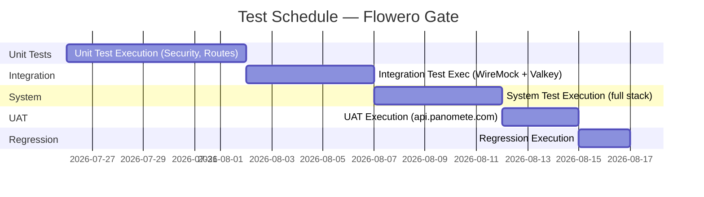

# Test Plan — Flowero Gate

> **Project:** Flowero Gate (Spring Cloud Gateway)
> **Version:** 1.0 | **Status:** Draft
> **Last Updated:** 2026-07-26

---

## Document Control

| Field | Value |
|-------|-------|
| Document Owner | QA Engineer |
| Approvals | PM, Tech Lead, QA Lead |

### Approvals

| Role | Name | Signature | Date |
|------|------|-----------|------|
| Project Manager | PO (Product Owner) | | |
| Technical Lead | Dev / SA Persona | | |
| QA Lead | QA Engineer | | |

---

## 1. Introduction

### 1.1 Purpose

> This plan defines the testing approach, scope, resources, schedule, and deliverables for the Flowero Gate API Gateway service. Flowero Gate is the internal API gateway for the Panomete Platform, routing, securing, and rate-limiting business API traffic at `api.panomete.com`.

### 1.2 Scope

| In Scope | Out of Scope |
|---------|-------------|
| Gateway route matching & path rewriting | Performance/load testing (separate plan) |
| JWT authentication validation (local JWKS) | Penetration testing of Cloudflare edge |
| Valkey-backed rate limiting | Nginx proxy configuration testing |
| CORS configuration | Flowero Guard / Discover internals |
| Circuit breaker fallbacks | Cloudflare Tunnel testing |
| Structured JSON request logging | TLS termination verification |
| OAuth2 login redirect flow | End-to-end business service logic |
| Error handling (404, 401, 429, 503) | |
| Trace ID propagation (W3C traceparent) | |

## 2. Test Strategy

| Level | Type | Automation | Coverage Target |
|-------|------|-----------|----------------|
| Unit | White-box | 100% | ≥ 80% code coverage |
| Integration | Gray-box | 80% | All gateway filters + route resolution |
| System | Black-box | 60% | All functional requirements (US-201 to US-205) |
| UAT | Black-box | 0% | All business scenarios via api.panomete.com |
| Regression | Black-box | 100% | All critical paths (JWT auth, routing, rate limiting) |

### Key Testing Tools

| Tool | Purpose |
|------|---------|
| JUnit 5 + Spring Boot Test | Unit and integration tests |
| WebTestClient | Reactive endpoint testing |
| WireMock | Stubbing Keycloak JWKS and upstream services |
| JwtTestHelper | Generating RSA-signed JWTs for auth tests |
| Gradle | Test execution (`./gradlew test`) |
| Valkey (testcontainer or embedded) | Rate limiting state verification |

## 3. Test Environment

| Environment | Purpose | URL | Data |
|------------|---------|-----|------|
| Local Dev | Developer testing | `localhost:8080` | Synthetic (WireMock) |
| Docker Compose | Integration testing | `localhost:8000` | Synthetic + local Valkey |
| Staging | Pre-production testing | `api.staging.panomete.com` | Anonymized production |
| Production | UAT verification | `api.panomete.com` | Real (read-only) |

### Test Configuration

The test environment uses `src/test/resources/application.yaml` which:
- Disables Eureka (`eureka.client.enabled=false`)
- Disables Redis (`spring.data.redis.enabled=false`)
- Uses WireMock on port 9000 for JWKS stub
- Excludes Eureka and Redis auto-configurations
- Sets `spring.cloud.loadbalancer.enabled=false`
- Defines a test route at `/api/v1/test/**`

## 4. Test Schedule

## 5. Test Resources

| Role | Name | Responsibility |
|------|------|---------------|
| QA Lead | QA Engineer | Test planning, coordination, defect triage |
| QA Engineer | QA Engineer | SecurityTests, RouteTests, integration tests |
| Dev | Dev Persona | Unit tests, test infrastructure (JwtTestHelper, TestSecurityConfig) |
| PO | PO (Product Owner) | UAT coordination, acceptance sign-off |

## 6. Entry & Exit Criteria

| Phase | Entry Criteria | Exit Criteria |
|-------|---------------|--------------|
| Unit | Code complete, PR merged | ≥ 80% coverage, all 9 tests pass |
| Integration | Unit tests pass, WireMock configured | All filter chains verified end-to-end |
| System | Integration tests pass, Docker Compose healthy | All 🔴 acceptance criteria verified |
| UAT | System tests pass, Gate deployed to staging | PO sign-off on all user stories |
| Regression | All defects fixed | No critical/high defects, 100% regression pass |

## 7. Defect Management

| Severity | Response Time | Resolution Time | Escalation |
|---------|-------------|----------------|-----------|
| Critical | 1 hour | 4 hours | PM + Tech Lead |
| High | 4 hours | 1 day | Tech Lead |
| Medium | 1 day | 3 days | — |
| Low | 3 days | Next sprint | — |

## 8. Risk & Mitigations

| Risk | Probability | Impact | Mitigation |
|------|-----------|--------|-----------|
| Valkey unavailable in test environment | Medium | High | ResilientRedisRateLimiter fails open; test with embedded Redis |
| WireMock port conflicts | Medium | Medium | Use dynamic port allocation or configurable port property |
| Keycloak JWKS endpoint unstable | Low | High | WireMock stub provides deterministic JWKS response |
| Eureka not available for lb:// tests | High | Medium | Use `@Import(TestSecurityConfig.class)` and disable load balancer |
| JWT clock skew causes flaky tests | Low | Medium | JwtTestHelper generates tokens with generous expiry margins |

---

## Related Documents

| Document | Relationship |
|----------|-------------|
| [[042_test_cases]] | Test case specifications |
| [[043_defect_report]] | Defect tracking |
| [[044_regression_test_suite]] | Regression suite definition |
| [[045_coverage_report]] | Coverage metrics |
| [[013_acceptance_criteria]] | Acceptance criteria being verified |
| [[022_API_specification]] | API contract under test |

---

> **Template Standard:** Based on SWEBOK v4, ISO/IEC/IEEE 29119
> **Usage:** This test plan is the contract for testing Flowero Gate. It covers the API gateway's core responsibilities: routing, JWT validation, rate limiting, and observability.
