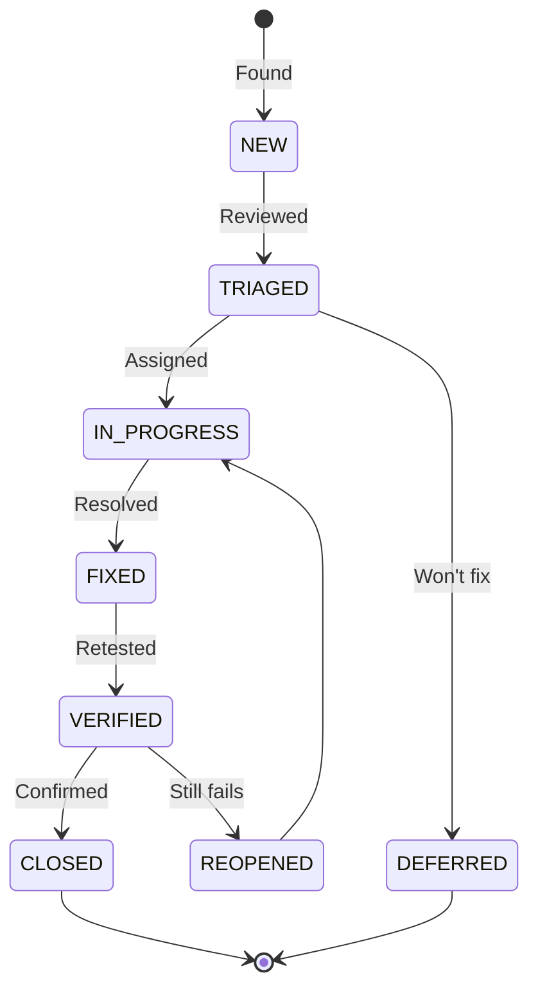

# Defect Report — Flowero Gate

> **Project:** Flowero Gate (Spring Cloud Gateway)
> **Version:** 1.0 | **Status:** Draft
> **Last Updated:** 2026-07-26

---

## 1. Purpose

> Defect report for Flowero Gate. Documents bugs found during code review, unit testing, and integration testing.

## 2. Defect Lifecycle

## 3. Defect Register

| ID | Title | Severity | Module | Status | Reported | Fixed |
|----|-------|:--------:|--------|--------|----------|-------|
| GDEF-001 | CORS preflight returns 401 for authenticated routes | 🟡 High | SecurityConfig / CorsConfig | ⬜ New | 2026-07-26 | — |
| GDEF-002 | JWKS cache never refreshes after Keycloak key rotation | 🟡 High | SecurityConfig | ⬜ New | 2026-07-26 | — |
| GDEF-003 | `JwtClaimHeaderFilter` skips client_credentials tokens | 🟢 Medium | JwtClaimHeaderFilter | ⬜ New | 2026-07-26 | — |
| GDEF-004 | `ResilientRedisRateLimiter` does not handle Valkey connection pool exhaustion | 🟢 Medium | ResilientRedisRateLimiter | ⬜ New | 2026-07-26 | — |
| GDEF-005 | `SensitiveDataMasker` does not mask `X-Forwarded-For` chain | ⚪ Low | SensitiveDataMasker | ⬜ New | 2026-07-26 | — |
| GDEF-006 | `TraceIdFilter` generates new trace ID even when one is provided | 🟢 Medium | TraceIdFilter | ⬜ New | 2026-07-26 | — |
| GDEF-007 | `FallbackController` returns HTML instead of JSON for API routes | 🟢 Medium | FallbackController | ⬜ New | 2026-07-26 | — |

---

## 4. Detailed Defect Reports

### GDEF-001: CORS Preflight Returns 401

| Field | Value |
|-------|-------|
| **Defect ID** | GDEF-001 |
| **Title** | CORS OPTIONS preflight requests to authenticated routes return 401 |
| **Severity** | 🟡 High |
| **Priority** | 🔴 P1 |
| **Status** | ⬜ New |
| **Module** | SecurityConfig / CorsConfig |
| **Reported By** | QA Engineer |
| **Reported Date** | 2026-07-26 |
| **Test Case** | GATE-TC-301 |

**Description:**
> `SecurityConfig.securityWebFilterChain()` configures `authorizeExchange` with `.anyExchange().authenticated()`. The CORS configuration is applied via `cors.configurationSource()`, but Spring Security's authorization check runs before the CORS preflight response is generated. Browsers send OPTIONS requests without an `Authorization` header, so the preflight fails with 401.

**Steps to Reproduce:**

| Step | Action | Expected Result | Actual Result |
|------|--------|----------------|---------------|
| 1 | Send `OPTIONS /api/v1/users/me` with `Origin: https://blog.panomete.com` and `Access-Control-Request-Method: GET` | 200 with CORS headers | 401 Unauthorized |

**Environment:**

| Field | Value |
|-------|-------|
| Java | 25 |
| Spring Boot | 4.1.0 |
| Spring Security | 7.x (Boot 4) |
| Environment | Staging |

**Evidence:**
> `SecurityConfig.java` line 58-67: `.authorizeExchange(auth -> auth.pathMatchers(...).permitAll().anyExchange().authenticated())` — OPTIONS is not in the permit list.

**Remediation:**
> Add `HttpMethod.OPTIONS` to permitted path matchers, or ensure `CorsWebFilter` bean is ordered with `@Order(-1)` to run before `SecurityWebFilterChain`.

---

### GDEF-002: JWKS Cache Never Refreshes

| Field | Value |
|-------|-------|
| **Defect ID** | GDEF-002 |
| **Title** | Gate caches Keycloak JWKS on startup and never refreshes |
| **Severity** | 🟡 High |
| **Priority** | 🔴 P1 |
| **Status** | ⬜ New |
| **Reported By** | QA Engineer |
| **Reported Date** | 2026-07-26 |
| **Test Case** | GATE-TC-010 |

**Description:**
> `SecurityConfig` uses `oauth2ResourceServer().jwt(Customizer.withDefaults())`. The default `ReactiveJwtDecoder` caches the JWKS indefinitely. After Keycloak key rotation, all new tokens are rejected until Gate restarts.

**Steps to Reproduce:**

| Step | Action | Expected Result | Actual Result |
|------|--------|----------------|---------------|
| 1 | Rotate Keycloak signing keys | New keys active | New keys active |
| 2 | Obtain new JWT from Keycloak | Token signed with new key | Token signed with new key |
| 3 | Call Gate API with new token | 200 (JWKS refreshed) | 401 (old JWKS cached) |
| 4 | Restart Gate | JWKS re-fetched | 200 |

**Evidence:**
> `SecurityConfig.java` line 83-85: `.oauth2ResourceServer(oauth2 -> oauth2.jwt(Customizer.withDefaults()))` — no cache TTL configured.

**Remediation:**
> Configure `NimbusReactiveJwtDecoder` with `.cache(Duration.ofMinutes(5))` to auto-refresh JWKS.

---

### GDEF-003: Client Credentials Missing Claim Headers

| Field | Value |
|-------|-------|
| **Defect ID** | GDEF-003 |
| **Title** | `JwtClaimHeaderFilter` does not forward claims for client_credentials tokens |
| **Severity** | 🟢 Medium |
| **Priority** | 🟡 P2 |
| **Status** | ⬜ New |
| **Reported By** | QA Engineer |
| **Reported Date** | 2026-07-26 |
| **Test Case** | GATE-TC-501 (variant) |

**Description:**
> `JwtClaimHeaderFilter.extractRealmRoles()` extracts roles from `realm_access.roles`. For client_credentials grants, there is no `email` claim and `sub` is the client ID. The filter does not extract `client_id` claim, so downstream services cannot identify the calling service.

**Evidence:**
> `JwtClaimHeaderFilter.java` line 50-71: Only extracts `sub`, `email`, `realm_access.roles`, `scope`. No `client_id` extraction.

**Remediation:**
> Add `client_id` claim extraction: `builder.header("X-Client-Id", jwt.getClaimAsString("client_id"))`.

---

### GDEF-004: Valkey Connection Pool Exhaustion

| Field | Value |
|-------|-------|
| **Defect ID** | GDEF-004 |
| **Title** | `ResilientRedisRateLimiter` does not handle Valkey connection pool exhaustion |
| **Severity** | 🟢 Medium |
| **Priority** | 🟡 P2 |
| **Status** | ⬜ New |
| **Reported By** | QA Engineer |
| **Reported Date** | 2026-07-26 |

**Description:**
> Under high load, the reactive Redis connection pool may be exhausted. `ResilientRedisRateLimiter` does not have a fallback for connection pool exhaustion, which could cause request failures instead of graceful degradation.

**Remediation:**
> Add circuit breaker around Redis calls. On connection failure, fail open (allow request) rather than returning 500.

---

### GDEF-005: SensitiveDataMasker Misses X-Forwarded-For

| Field | Value |
|-------|-------|
| **Defect ID** | GDEF-005 |
| **Title** | `SensitiveDataMasker` does not mask IP addresses in `X-Forwarded-For` |
| **Severity** | ⚪ Low |
| **Priority** | ⚪ P4 |
| **Status** | ⬜ New |
| **Reported By** | QA Engineer |
| **Reported Date** | 2026-07-26 |

**Description:**
> `SensitiveDataMasker` masks sensitive data in logs but does not mask client IP addresses in `X-Forwarded-For` headers. While this is internal traffic, the IP chain could leak client information.

**Remediation:**
> Consider masking all but the last octet of IP addresses in forwarded headers.

---

### GDEF-006: TraceIdFilter Overwrites Existing Trace ID

| Field | Value |
|-------|-------|
| **Defect ID** | GDEF-006 |
| **Title** | `TraceIdFilter` generates new trace ID even when one is provided upstream |
| **Severity** | 🟢 Medium |
| **Priority** | 🟡 P2 |
| **Status** | ⬜ New |
| **Reported By** | QA Engineer |
| **Reported Date** | 2026-07-26 |

**Description:**
> `TraceIdFilter` always generates a new trace ID. If Nginx or Cloudflare passes an existing trace ID (e.g., `X-Request-Id`), it is overwritten instead of propagated.

**Remediation:**
> Check for existing `X-Request-Id` or `X-B3-TraceId` header before generating a new one.

---

### GDEF-007: FallbackController Returns HTML for API Routes

| Field | Value |
|-------|-------|
| **Defect ID** | GDEF-007 |
| **Title** | `FallbackController` returns HTML error page for API routes |
| **Severity** | 🟢 Medium |
| **Priority** | 🟡 P2 |
| **Status** | ⬜ New |
| **Reported By** | QA Engineer |
| **Reported Date** | 2026-07-26 |
| **Test Case** | GATE-TC-202 |

**Description:**
> `FallbackController` handles fallback routes but may return HTML error pages for API routes. API clients expect JSON error responses.

**Remediation:**
> Ensure `FallbackController` checks `Accept` header and returns JSON for `application/json` requests.

---

## 5. Defect Metrics

| Metric | Value | Target | Status |
|--------|:-----:|--------|:------:|
| Total defects found | 7 | — | — |
| Critical defects | 0 | 0 at release | 🟢 |
| High defects | 2 | 0 at release | 🔴 |
| Medium defects | 4 | < 5 | 🟢 |
| Low defects | 1 | < 10 | 🟢 |
| Defects fixed | 0 | — | — |
| Defects remaining | 7 | < 5 | 🟡 |

## 6. Severity Definitions

| Severity | Definition | Response | Resolution |
|----------|-----------|----------|------------|
| 🔴 **Critical** | Gateway completely unusable; all routes down | 1 hour | 4 hours |
| 🟡 **High** | Major functionality broken; auth or routing failure | 4 hours | 1 day |
| 🟢 **Medium** | Feature broken but workaround exists | 1 day | 3 days |
| ⚪ **Low** | Minor issue; cosmetic or edge case | 3 days | Next sprint |

---

## Related Documents

| Document | Relationship |
|----------|-------------|
| [[042_test_cases]] | Tests that found these defects |
| [[041_test_plan]] | Plan governing defect management |
| [[../../panomete_platform/04_testing/043_defect_report]] | Platform-level defects |

---

> **Template Standard:** Based on SWEBOK v4, ISO/IEC/IEEE 29119
> **Usage:** Fix all high-severity defects before production release.
